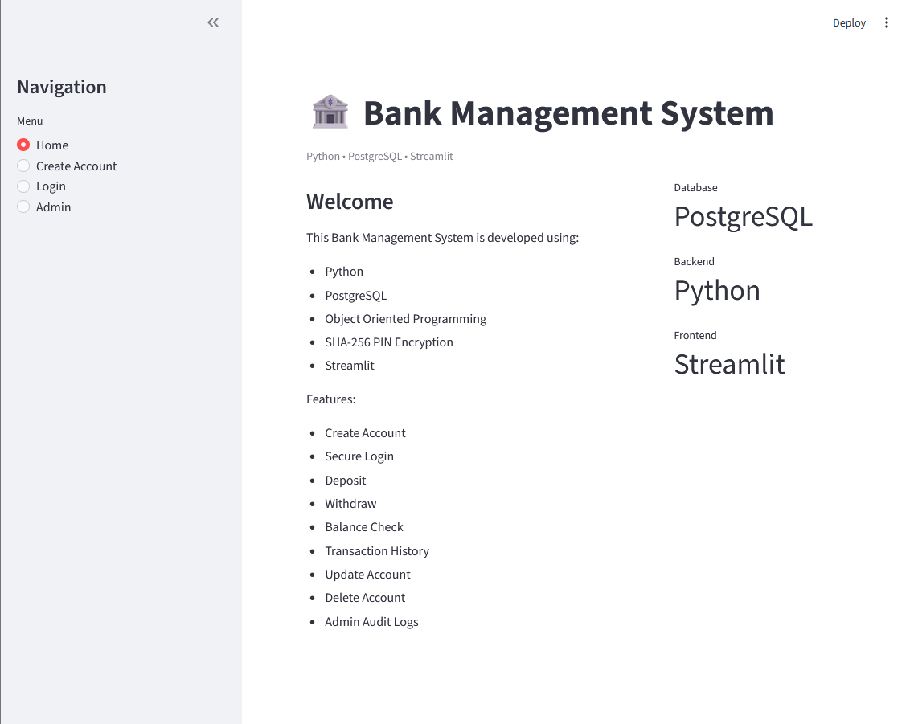
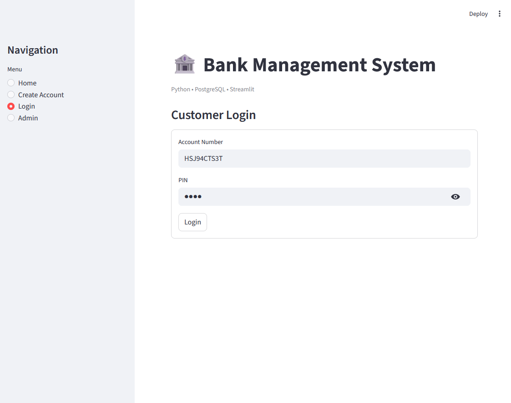
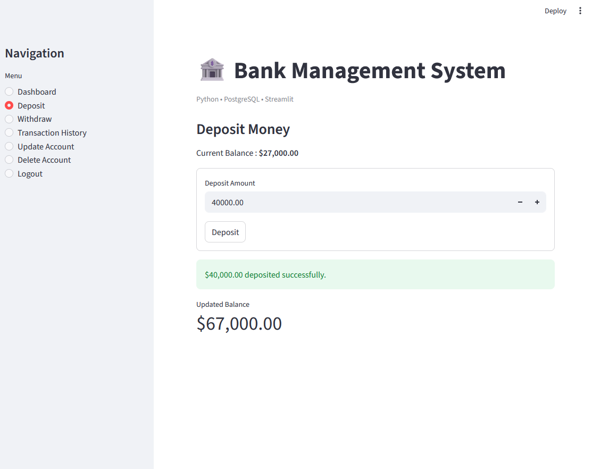

# 🏦 Bank Management System


A full-stack **Bank Management System** built using Python, PostgreSQL, and Streamlit.  
This project simulates real-world banking operations with secure login, transactions, and audit logging.

---

## 🚀 Live Demo
👉 https://gargik283-bank-management-system-app-gkw546.streamlit.app/

---

## 📌 Features

### 👤 Customer Features
- Create new bank account
- Secure login using account number and PIN
- Check account balance
- Deposit money
- Withdraw money
- View transaction history
- Update account details (name, PIN)
- Delete account

### 🛠️ Admin Features
- View all audit logs
- Clear audit logs

### 🔐 Security Features
- SHA-256 PIN encryption
- Secure authentication system
- Session-based login using Streamlit

---

## 🧰 Tech Stack

- **Frontend:** Streamlit  
- **Backend:** Python (OOP)  
- **Database:** PostgreSQL  
- **Security:** hashlib (SHA-256)  
- **Libraries:** psycopg2, pandas  

---

## 🏗️ Project Structure

```
Bank-Management-System/
│── app.py              # Streamlit frontend
│── main.py             # Core banking logic
│── database.py         # PostgreSQL connection
│── README.md           # Project documentation
```

---

## 🗄️ Database Schema

### Accounts Table
- account_number (Primary Key)
- name
- pin (hashed using SHA-256)
- balance
- created_at

### Audit Table
- id
- account_number
- holder_name
- action
- amount
- timestamp

---

## 📸 Screenshots

### 🏠 Home Page


### 👤 Create Account


### 🔑 Login Page


### 📊 Dashboard


### 💰 Deposit / Withdraw


### 📜 Transaction History


---

## ⚙️ Installation & Setup

### 1. Clone Repository
```bash
git clone https://github.com/your-username/bank-management-system.git
cd bank-management-system
```

---

### 2. Install Dependencies
```bash
pip install streamlit psycopg2 pandas
```

---

### 3. Setup PostgreSQL Database
- Create database: `banksystemmanagement`
- Update credentials in `database.py`

---

### 4. Run Application
```bash
python -m streamlit run app.py
```

---

## 📊 Project Highlights

- Object-Oriented Programming (OOP)
- Real-world banking system simulation
- Secure authentication using SHA-256
- Transaction audit logging system
- Clean Streamlit UI
- PostgreSQL relational database design

---

## 🎯 Data Analyst Relevance

This project demonstrates:
- Structured relational database design
- SQL-based transaction storage
- Data tracking through audit logs
- Real-world dataset simulation
- Foundation for analytics dashboards

---

## 🚀 Future Improvements

- Role-based login (Admin/User separation)
- Data visualization dashboard
- Cloud database integration
- Transaction analytics charts
- Email notifications

---

## 👨‍💻 Author

**Gargi Kundu**  
Aspiring Data Analyst | Python | SQL | PostgreSQL  
Passionate about data analysis and building real-world data projects.

---

## ⭐ Support

If you like this project, give it a ⭐ on GitHub!
