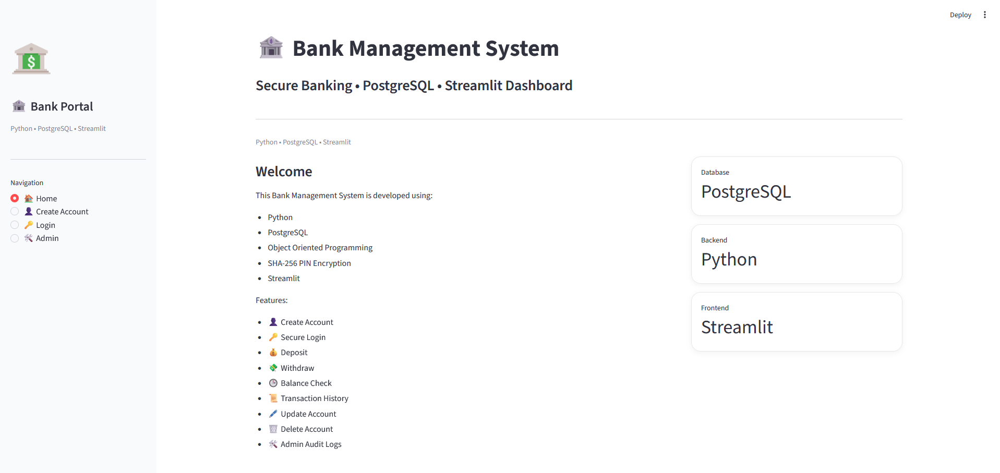
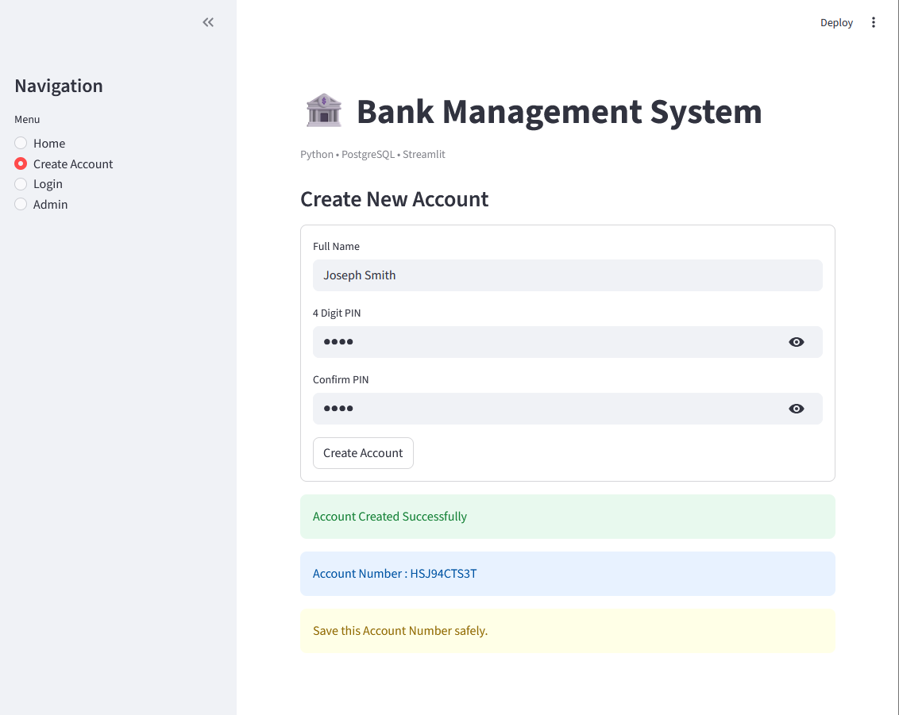
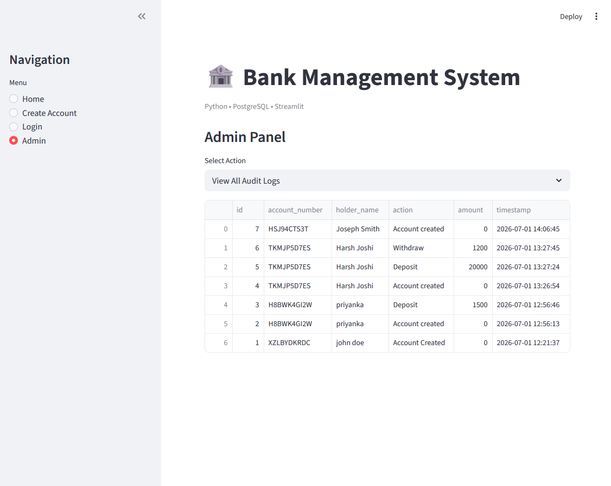
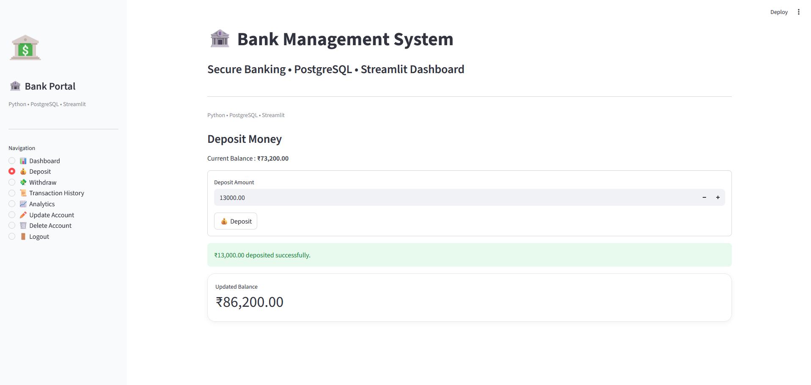
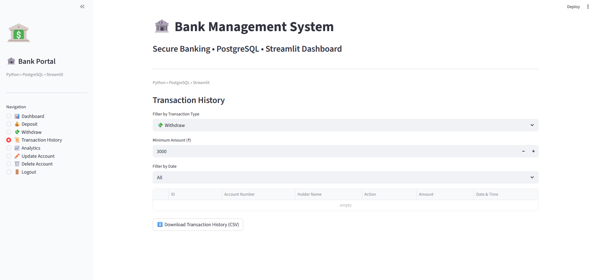
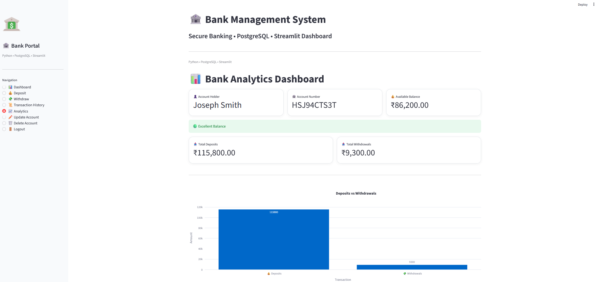
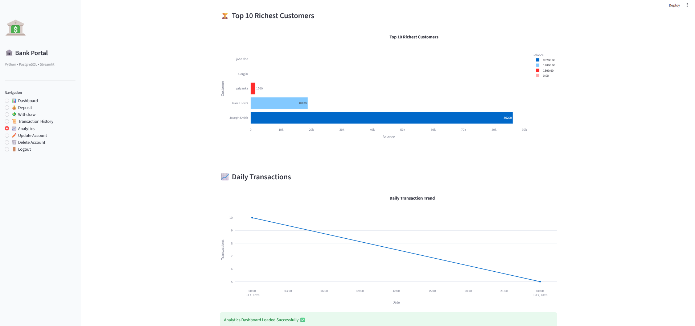

# 🏦 Bank Management System with Analytics Dashboard

<p align="center">


</p>

<p align="center">

<b>🚀 A Secure Banking Management System built using Python, PostgreSQL & Streamlit</b>

Manage bank accounts, perform secure transactions, visualize analytics, and maintain audit logs through an interactive web application.

🌐 **Live Demo:** https://bank-management-system123.streamlit.app/

</p>

---

# 🌟 Executive Summary

The **Bank Management System** is a full-stack banking application developed using **Python**, **PostgreSQL**, and **Streamlit**.

It simulates real-world banking operations including secure account management, deposits, withdrawals, transaction tracking, audit logging, and interactive analytics. The project demonstrates practical implementation of **Object-Oriented Programming (OOP)**, **relational database design**, **secure authentication**, and **data visualization**.

---

# ✨ Key Features

### 👤 Customer Operations

- Create New Account
- Secure Login
- Deposit Money
- Withdraw Money
- View Account Balance
- Update Customer Details
- Change PIN
- Delete Account
- View Transaction History
- Download Transactions as CSV

### 📊 Analytics Dashboard

- Deposit vs Withdrawal Analysis
- Daily Transaction Trends
- Top 10 Richest Customers
- Account Balance Distribution
- Interactive Plotly Visualizations

### 🛡️ Security

- SHA-256 PIN Hashing
- Parameterized SQL Queries
- Session-Based Authentication
- Secure PostgreSQL Database

### 🛠️ Admin Features

- View Audit Logs
- Clear Audit Logs
- Monitor User Activities

---

# 💻 Tech Stack

| Technology | Role |
|------------|------|
| Python | Backend Logic |
| PostgreSQL | Relational Database |
| Streamlit | Interactive Web Application |
| Plotly | Data Visualization |
| Pandas | Data Processing |
| psycopg2 | Database Connectivity |
| hashlib | Secure PIN Hashing |
| python-dotenv | Environment Variables |

---

# 📸 Application Preview

## 🏠 Home



---

## 👤 Create Account



---

## 🔑 Login


---

## 📊 Dashboard



---

## 💰 Deposit Transaction



---

## 📜 Transaction History



---

## 📈 Analytics Dashboard





---

# 🏗️ System Architecture

```text
          Streamlit Web Interface
                    │
                    ▼
        Python Business Logic (OOP)
                    │
                    ▼
         PostgreSQL Database
                    │
                    ▼
      Audit Logs & Transaction Records
```

---

# 📂 Project Structure

```text
Bank-Management-System/
│
├── screenshots/
├── app.py
├── main.py
├── database.py
├── pdf_generator.py
├── requirements.txt
├── README.md
├── .gitignore
└── .env
```

---

# 🗄️ Database

The application uses PostgreSQL to manage banking operations with two primary tables:

### Accounts

- Account Number
- Customer Name
- PIN (SHA-256 Hash)
- Balance
- Created Date

### Audit Logs

- Account Created
- Deposit
- Withdrawal
- Account Updated
- Account Deleted
- Timestamp

---

# ⚙️ Installation

Clone the repository:

```bash
git clone https://github.com/Gargik283/bank-management-system.git
```

Navigate to the project folder:

```bash
cd bank-management-system
```

Install dependencies:

```bash
pip install -r requirements.txt
```

Create a `.env` file:

```env
DB_HOST=your_host
DB_PORT=your_port
DB_NAME=your_database
DB_USER=your_username
DB_PASSWORD=your_password
```

Run the application:

```bash
streamlit run app.py
```

---

# 📊 Analytics Included

- Deposit vs Withdrawal Analysis
- Daily Transaction Trends
- Top 10 Richest Customers
- Account Balance Distribution
- Audit Log Monitoring

---

# 🚀 Future Enhancements

- OTP-Based Authentication
- Role-Based Access Control
- Email Notifications
- Cloud Database Integration
- Docker Deployment
- AI-Based Fraud Detection
- Power BI Dashboard Integration

---

# 👩‍💻 Author

**Gargi Kundu**

Aspiring **Data Analyst** | Python | SQL | PostgreSQL | Streamlit | Power BI

📧 **Email:** gargikundu211@gmail.com

💼 **LinkedIn:** https://www.linkedin.com/in/gargi-kundu

🐙 **GitHub:** https://github.com/Gargik283

---

# ⭐ Support

If you found this project useful, consider giving it a ⭐ on GitHub.
