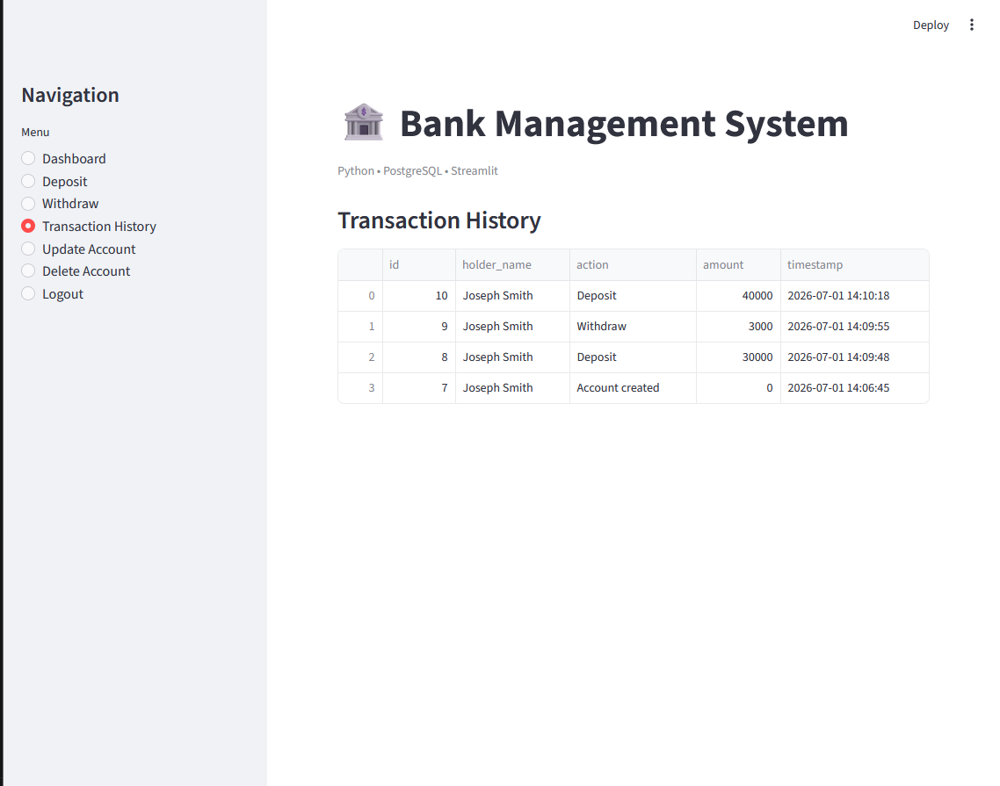

# 🏦 Bank Transaction Analysis System (Python + SQL + Streamlit)


A **data-driven banking system** built using Python, PostgreSQL, and Streamlit that simulates real-world financial transactions with structured data storage and audit tracking.

---

## 🚀 Live Demo
👉 https://gargik283-bank-management-system-app-gkw546.streamlit.app/

---

## 🎯 Project Objective

This project demonstrates how financial systems store, process, and track transaction data using **SQL databases and Python-based logic**, focusing on structured data management and audit trails.

---

## 📊 Data Analyst Focus

This project highlights key data skills:

- Relational database design (PostgreSQL)
- Transaction-level data generation
- Audit logs for tracking user activity
- SQL-based data storage and retrieval
- Structured dataset suitable for analytics
- Foundation for dashboards and reporting systems

---

## 🧠 Key Functionalities

### 👤 Customer Operations
- Account creation with secure authentication
- Login using account number and PIN
- Deposit & withdrawal transactions
- Balance tracking
- Transaction history view
- Account update and deletion

### 🛠️ System Features
- Audit logging for all transactions
- Admin-level log monitoring
- Secure data handling with hashed PINs

---

## 🔐 Security Design
- SHA-256 hashing for PIN protection
- Parameterized SQL queries (prevents injection)
- Session-based authentication using Streamlit

---

## 🧰 Tech Stack

- **Frontend:** Streamlit  
- **Backend:** Python (OOP)  
- **Database:** PostgreSQL  
- **Security:** hashlib (SHA-256)  
- **Libraries:** psycopg2, pandas  

---

## 🏗️ System Architecture

```
User Interface (Streamlit)
        ↓
Business Logic (Python OOP)
        ↓
PostgreSQL Database
        ↓
Audit Logging System
```

---

## 📸 Screenshots

### 🏠 Home Page


### 👤 Create Account


### 🔑 Login Page


### 📊 Dashboard


### 💰 Deposit / Withdraw


### 📜 Transaction History
 

---

## 📈 Business & Data Value

This system simulates real banking datasets that can be used for:

- Customer transaction analysis
- Financial behavior tracking
- Fraud detection patterns (future scope)
- SQL reporting and analytics
- Dashboard creation (Power BI / Streamlit)

---

## 🚀 Future Enhancements

- Data visualization dashboard (charts & insights)
- Role-based authentication (Admin/User)
- Cloud database integration
- Export data to Excel/CSV
- Advanced analytics on transactions

---

## 👨‍💻 Author

**Gargi Kundu**  
Aspiring Data Analyst | Python | SQL | PostgreSQL  

Focused on building real-world data systems and analytical applications.

---

## ⭐ Note

If you find this project useful, please consider starring the repository.
